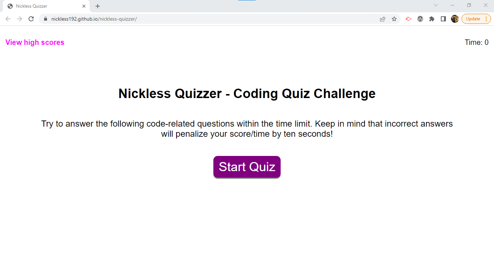

# Nickless Quizzer

## Description
Welcome to the Nickless Quizzer! This assessment tool will present the user with up to 20 multiple choice questions to answer within 75 seconds. For each correct answer, a point is awarded to the user; for each wrong answer, 5 seconds are deducted from the timer. The assessment ends when either all 20 questions have been answered or if the timer runs out.

The assessment starts with a simple page asking the user to start the quiz. Once clicked, the first question is shown on screen, and the user can hover over the answer buttons and click on it to choose it. At this point, the answer validation is performed, and at the bottom of the page we will provide feedback, either "Correct" or "Wrong".

After reaching the end of the quiz, the user will have the opportunity to save their score alongside their initials so that this can be later viewed in the "View High Scores" page.

Accessing the "View High Scores" is done from the main page only, and this is done to ensure that the user doesn't get distracted while doing the assessment. On the "View High Scores" page, the user will be shown all previous scores from previous users and will be given the option to clear all scores from memory and to go back to the previous page.

## User Story
AS A coding boot camp student 
I WANT to take a timed quiz on JavaScript fundamentals that stores high scores 
SO THAT I can gauge my progress compared to my peers 

## Acceptance Criteria
GIVEN I am taking a code quiz 
WHEN I click the start button 
THEN a timer starts and I am presented with a question 
WHEN I answer a question 
THEN I am presented with another question 
WHEN I answer a question incorrectly 
THEN time is subtracted from the clock 
WHEN all questions are answered or the timer reaches 0 
THEN the game is over 
WHEN the game is over 
THEN I can save my initials and score 

## Screenshot of Deployed Site

### Nickless Quizzer Landing Page
 

## Links

GitHub link: https://github.com/nickless192/nickless-quizzer

Deployed Page: https://nickless192.github.io/nickless-quizzer/

## Contributors

Made with ❤️ by Nickless192 (Omar Rodriguez)